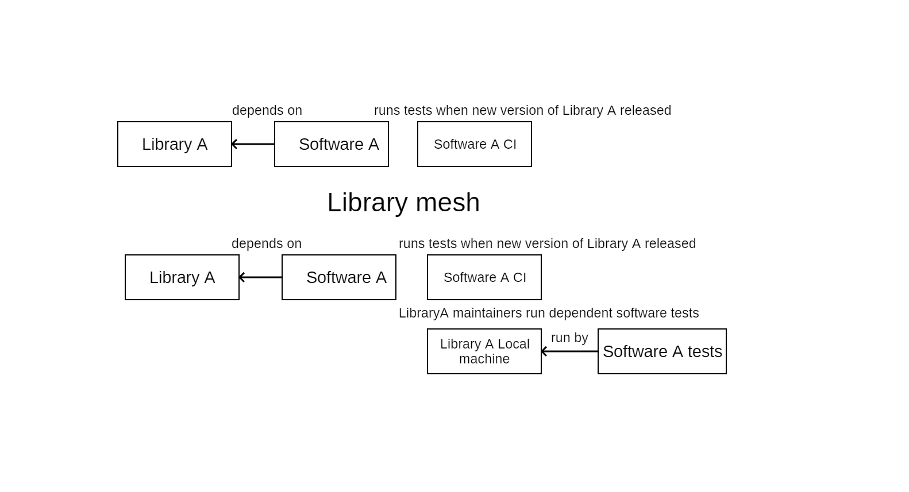

# library-mesh

Imagine if when you require a library, the library's infrastructure code gets informed about your project and your project builds as a test case of the upstream library.

I've picked this name because it makes software testing more coupled in a good and right way.

# Dependency addition

Adding a dependency to a library adds the sourcecode of the project to upstream builds.
